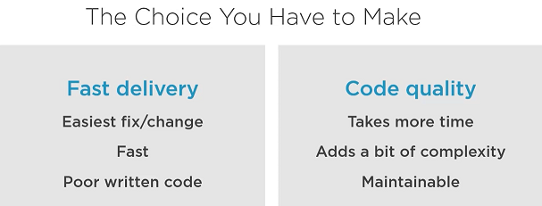
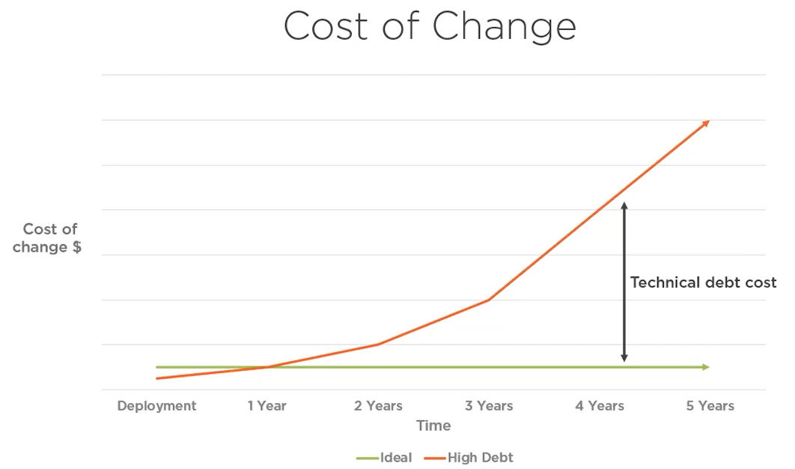
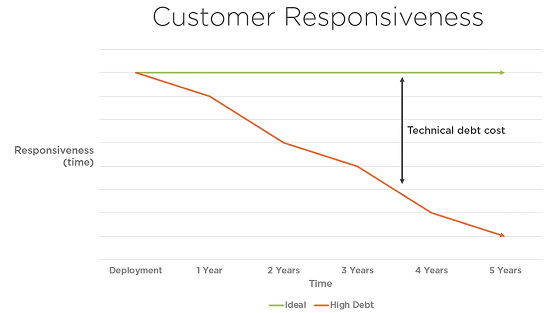

<pre style="color: aqua; font-size: x-large">
“It is not enough for code to work. Code that works is often badly broken.
Programmers who satisfy themselves with merely working code are behaving 
unprofessionally. They may fear that they don’t have time to improve the 
structure and design of their code, but I disagree. Nothing has a more profound 
and long-term degrading effect upon a development project than bad code.”

Robert C. Martin, Clean Code: A Handbook of Agile Software Craftsmanship 
</pre>

> ## <pre>SOLID principles are the   foundation on which we      can build clean,   maintainable architectures.</pre>
***Code Fragility*** 
<pre>
Fragility is the tendency of the software to break in many places every time it is changed.
- Robert C. Martin
</pre>
***Code Rigidity***
<pre>
Rigidity is the tendency for software to be difficult to change, even in simple ways. Every 
change causes a cascade of subsequent changes in dependent modules.
- Robert C. Martin
</pre>
*Fragility and Rigidity are symptoms of high technical debt.*
***Technical Debt***
<pre>
The cost of prioritizing fast delivery over code quality for long periods of time.
</pre> 

***Technical Debt Facts***
<pre>
No matter how good team is, technical debt will accumulate over time.
Left uncontrolled, it will kill your project
The key is to keep it under control.

write code        pay debt (code refactor)
write more code   pay debt (code refactor)
</pre>
##### Controlling Technical Debt - Continuous code refactor
#### SOLID Principles 
Acronym for 5 software design principles that help us to keep technical debt under control.
1. *S*ingle Responsibility Principle
2. *O*pen Closed Principle
3. *L*iskov Substitution Principle
4. *I*nterface Segregation Principle
5. *D*ependency Inversion Principle 
 

***The Benefits of SOLID Code***
* Easy to understand and reason about
* Changes are faster and have a minimal risk level
* Highly maintainable over long period of time
* Cost-effective
#### Other Ways to Keep Your Architecture Clean
* Constant Refactoring
* Design Patterns
* Unit Testing (TDD)