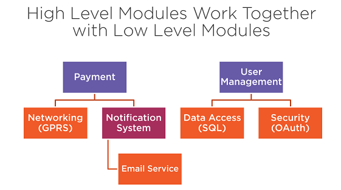
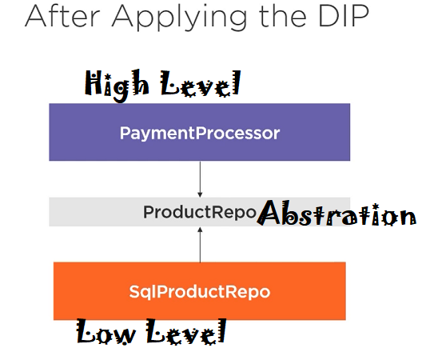
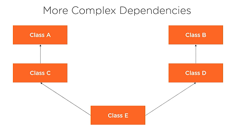
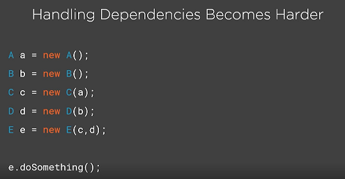
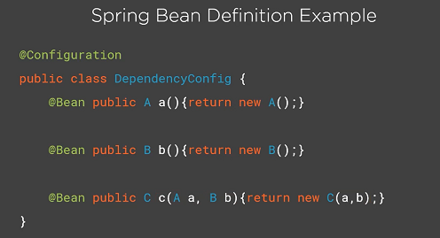
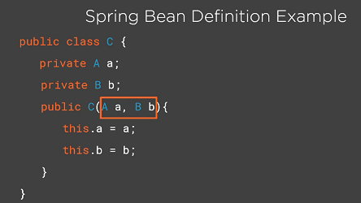

## Decoupling Components with the Dependency Inversion Principle

1. **High level modules** shouldn't depend on  
   **low level modules;** both should depend on abstractions.  
2. **Abstractions** should not depend on details.  
   Details should depend on abstraction.
   
***High Level Modules***

* Modules written to solve real problems and use cases.
* They are more abstract and map to business domain.
* What the software should do.

***Low Level Modules***

* Contain implementation details that are required to  
  execute the business policies
* They are considered the "plumbing" or "internal" of  
  an application.
* How the software should do various task.

***Example of Low Level Module***

* Data access
* Logging
* Network communication
* IO

## Abstraction 
<pre>
Something that are not concrete.
Something that you can not "new" up. In java applications,
we tend to model abstractions using interfaces and 
abstract classes.
</pre>

***Low Level Class***

<pre>
  class SqlProductRepo {
     p Product getById(String productId) {
        // Grab product from database
     }
  }
</pre>

***High Level Class***

<pre>
  class PaymentProcessor {
     p v pay(String productId) {
        SqlProductRepo repo = new SqlProductRepo();
        Product product = repo.getById(productId);
        this.processPayment(product);
     }
  }
</pre>

***Solution***

<pre>
   Product Repository Abstraction

   interface ProductRepo {
      Product getById(String productId);
   }

   Low Level Class Depends On Abstraction

   class SqlProductRepo implements ProductRepo {
     p Product getById(String productId) {
        // Concrete details for fetching product from database
     }
  }

  class MongoProductRepo implements ProductRepo {
     p Product getById(String productId) {
        // Concrete details for fetching product from database
     }
  }

  High level class depends on abstraction

  class PaymentProcessor {
     p v pay(String productId) {
        ProductRepo repo = ProductRepoFactory.create("sql");
        Product product = repo.getById(productId);
        this.processPayment(product);
     }
  }
  
  class ProductRepoFactory {
   
      p s ProductRepo create(String type){
         if(type.equals("mongo"))
            return new MongoProductRepo(String type);
         else if(type.equals("sql"))
            return new SqlProductRepo(String type);
      }
  }

</pre>

## Dependency Injection

<pre>
A technique that allows the creation of dependent
object outside of a class and provides those objects
to a class.
</pre>

***Still some coupling***

<pre>

  The create inside method

  class PaymentProcessor {
     p v pay(String productId) {
        ProductRepo repo = ProductRepoFactory.create("sql");
        Product product = repo.getById(productId);
        this.processPayment(product);
     }
  }

  Declaring Dependencies In Constructor

  class PaymentProcessor {

     p PaymentProcessor(ProductRepo repo) { this.repo = repo }
     p v pay(String productId) {
        Product product = repo.getById(productId);
        this.processPayment(product);
     }
  }

  Passing Dependencies

  ProductRepo repo = ProductRepoFactory.create("sql");
  PaymentProcessor proc = new PaymentProcessor(repo);
  repo.pay("123");
</pre>

 

## Inversion of Control
<pre>
Inversion of Control is a design principle in which the
control of object creation, configuration, and lifecycle is
passed to a container or framework. 

1. You don't "new" up objects
   They are created by someone else(IoC Container)
2. Control of Object creation  is inverted
   - It is not the programmer, but someone else who controls the objects.
It makes sense to use it for some objects in an application
(Services, data access, controllers)
- For others (entities, value object) it doesn't

</pre>
#### IOC Container Benefits
* Make it easy to switch between different implementations at runtime
* Increased program modularity
* Manages the lifecycle of objects and their configuration.
  Example - Spring Bean managed by IoC

 

>><pre>The DIP, DI and IoC are the  most effective ways to  eliminate code coupling and keep systems easy to maintain and evolve</pre>
<pre>
    "New is Glue"
</pre>
