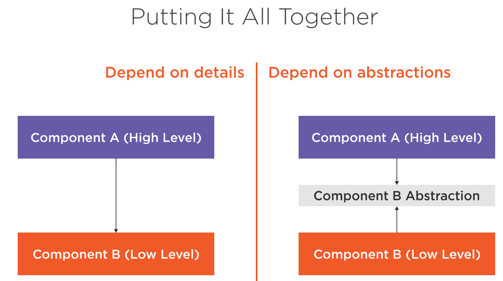

## Decoupling Components with the Dependency Inversion Principle

1. **High level modules** shouldn't depend on  
   **low level modules;** both should depend on abstractions.  
2. **Abstractions** should not depend on details.  
   Details should depend on abstraction.

### High Level Modules
* Modules written to solve real problems and use cases.
* They are more abstract and map to business domain.
* What the software should do.
### Low Level Modules
* Contain implementation details that are required to  
  execute the business policies
* They are considered the "plumbing" or "internal" of  
  an application.
* How the software should do various task.
***Example of Low Level Module***
* Data access
* Logging
* Network communication
* IO

## Abstraction 
<pre>
Something that are not concrete.
Something that you can not "new" up. In java applications,
we tend to model abstractions using interfaces and 
abstract classes.
</pre>

## Dependency Injection
<pre>
A technique that allows the creation of dependent
object outside of a class and provides those objects
to a class.
</pre>
## Inversion of Control
<pre>
Inversion of Control is a design principle in which the
control of object creation, configuration, and lifecycle is
passed to a container or framework. 
</pre>
#### IOC Container Benefits
* Make it easy to switch between different implementations at runtime
* Increased program modularity
* Manages the lifecycle of objects and their configuration.
>><pre>The DIP, DI and IoC are the  most effective ways to  eliminate code coupling and keep systems easy to maintain and evolve</pre>

* Persistence
* Logging
* Orchestration
* Users
>><pre>Always identify the reasons to change that your components have    and reduce them to       a single one</pre>
<pre>
Why Should You Use SRP?

It makes code easier to understand, fix and maintain

Classes are less coupled and more resilient to change

More testable design
</pre>
Monster Method
God Class
Coupling - The level of inter-dependency between various software components.
<pre>
If Module A Knows too much about Module B,
changes to the internals of Module B may break
functionality in Module A.
</pre>
>><pre>"We want to design components that are self-contained: independent, and with a single, well-defined purpose"  Andrew Hunt & David Thomas, The Pragmatic Programmer</pre>
