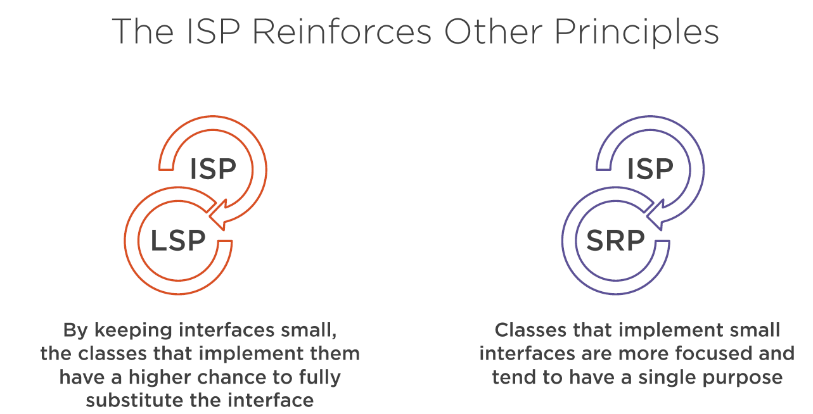

## Modularizing Abstractions with the Interface Segregation Principle (ISP)
### Interface Segregation Principle
***Client should not be forced to depend on methods that do not use.***
<pre>
The "Interface" word in the principle
name doesn't strictly mean a java interface.
</pre>

#### Benefits of Applying the ISP
* Lean interfaces minimize dependencies on unused members and reduce code coupling.
* Code becomes more cohesive and focused
* It reinforces the use of the SRP and LSP
***Fat Interface***
* Interface with Many Methods
* Throwing Exceptions
* Interface with Low Cohesion
* Increased Coupling
* Not just About Interfaces
* Empty Methods
****Symptoms of Interface Pollution****
* Interface with lots of methods
* Interface with low cohesion
* Client throws exception instead of implementing method
* Client provides empty implementation
* Client force implementation and become highly coupled
****Fixing Interface Pollution****
<pre>
Your own code
Breaking Interface is pretty easy and safe due to the
possibility to implement as many interfaces as we want
</pre>
<pre>
External Legacy Code
You can't control the interfaces in the external code,
So you can use design pattern like "Adapter"
</pre>

>><pre>"Fat interface led to inadvertent   coupling between clients   that ought otherwise to be isolated " Robert C. Martin</pre>
Many clint specific interfaces are better than one general purpose interface