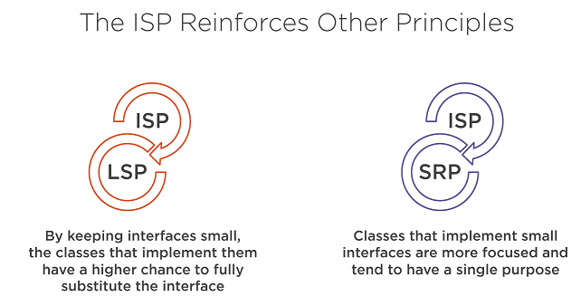

## Modularizing Abstractions with the Interface Segregation Principle (ISP)
### Interface Segregation Principle
***Client should not be forced to depend on methods that do not use.***
<pre>
The "Interface" word in the principle
name doesn't strictly mean a java interface.
</pre>

#### Benefits of Applying the ISP
* Lean interfaces minimize dependencies on unused members and reduce code coupling.
* Code becomes more cohesive and focused
* It reinforces the use of the SRP and LSP
#### Fat Interface
<pre>
   
   Interface with Many Methods

   interface LoginService {
      void signIn();
      void signOut();
      void updateRememberMeCookie();
      User getUserDetails();
      void setSessionExpiration(int session);
      void validToken(Jwt token);
   }
</pre>
#### Throwing Exceptions
<pre>
   class GoogleLoginService extends LoginService {
       void updateRememberMeCookie(){
          throw new UnsupportedOperationException();
       }
       void setSessionExpiration(int session) {
          throw new UnsupportedOperationException();
       }
   }
</pre>
#### Interface with Low Cohesion
<pre>
   interface ShoppingCart {
      void addItem(Item item);
      void removeItem(Item item);
      void processPayment();
      boolean checkItemInStock(Item item);
   }
</pre>
#### Increased Coupling
<pre>
    class ShoppingCartImpl implements ShoppingCart {
       v processPayment() {
          PaymentService ps = new PaymentService();
          ps.pay(this.totalAmount);
          User user = UserService.getUserTransaction();
          EmailService emailService = new EmailService();
          emailService.notify(user);
       }
    }
</pre>
#### Not just About Interfaces
<pre>
   abstract class Account {
      abstract double getBalance();
      abstract void processLocalPayment(double amount);
      abstract void processInternationalPayment(double amount);
   }
</pre>
#### Empty Methods
<pre>
   class SchoolAccount extends Account {
      void processInternationalTransfer(double amount){ 
         // Do nothing. Better then throwing an error, right?
         throw new RuntimeException("Not Implemented")
      }
   }
</pre>
****Symptoms of Interface Pollution****
* Interface with lots of methods
* Interface with low cohesion
* Client throws exception instead of implementing method
* Client provides empty implementation
* Client force implementation and become highly coupled
****Fixing Interface Pollution****
<pre>
Your own code
Breaking Interface is pretty easy and safe due to the
possibility to implement as many interfaces as we want
</pre>
<pre>
   From a Fat Interface

   interface class Account {
      abstract double getBalance();
      abstract void processLocalPayment(double amount);
      abstract void processInternationalPayment(double amount);
   }

   interface BankAccount {
      abstract double getBalance();
   }

   interface LocalMoneyTransferCapability {
      void processLocalPayment(double amount);
   }
 
   interface IntlMoneyTransferCapability {
      void processInternationalPayment(double amount);
   }

   // Cohesive client
   class SchoolAccount implements BankAccount, LocalMoneyTransferCapability {
      // We can now correctly implement all the method
   }

   // Interface reuse
   class InternationalLocalService implements IntlMoneyTransferCapability {
      p v processInternationalPayment() {
         // Process international payment
      }
   }

</pre>
<pre>
External Legacy Code
You can't control the interfaces in the external code,
So you can use design pattern like "Adapter"
</pre>

>><pre>"Fat interface led to inadvertent   coupling between clients   that ought otherwise to be isolated " Robert C. Martin</pre>
***Many clint specific interfaces are better than one general purpose interface***
