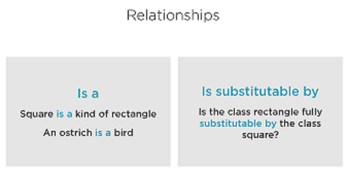

## Applying the Liskov Substitution Principle (LSP)
### Liskov Substitution Principle
<pre style="font-size: medium;">
If S is a subtype of T, then object of type T in a program
may be replaced with objects of type S without
modifying the functionality of the program.
</pre>
<pre style="font-size: medium;">
Any object of a type must be substitutable by objects 
of a derived typed without altering the correctness of 
that program
</pre>

>><pre>Incorrect relationship between  type cause unexpected bugs or     side effects.</pre>
### Violations Of The Liskov Substitution Principle
#### A. Empty methods/Functions
<pre>

   class Bird {
      p v fly(int altitude){
         setAltitude(altitude);
         // fly logic
      }
   }

   class Ostrich extends Bird {
      @Override p v fly(int altitude){
         // Do nothing; An Ostrich can't fly 
      }
   }

   Bird ostrich = new Ostrich();
   ostrich.fly(1000);

   Fixed Empty methods/Functions

   class Bird {
      // Bird data and capabilities
      p v fly(int altitude){...}
   }

   class Ostrich {
      // Ostrich data and capabilities. No fly method.
   }
</pre>
#### B) Partial Implemented Interfaces
<pre>

   interface Account {
      void processLocalTransfer(double amount);
      void processInternationalTransfer(double amount);
   }

   class SchoolAccount implements Account {
      void processLocalTransfer(double amount){//Business logic here}
      void processInternationalTransfer(double amount){ throw new RuntimeException("Not Implemented")}
   }

   Account account = new SchoolAccount();
   account.processInternationalTransfer(1000); // Will crash

   Fixed Partial Implemented Interfaces

   class SchoolAccount implements LocalAccount {
       void processLocalTransfer(double amount){//Business logic here}
   }

</pre>
#### C) Type Checking
<pre>
 
   for (Task t : tasks) {
     if(t instanceof BugFix) {
        BugFix bf = (BugFix)t;
        bf.initializeBugDescription();
     }
     t.setInProgress();
   }

   Fixed type checking
   
   class BugFix extends Task {
      @Override
      p v setInProgress() {
        this.initializeBugDescription();
        super.setInProgress();
      }
   }

   Tell, Don't ask

   for (Task t : tasks) {
     // Task should be replaceable by BugFix
     t.setInProgress();
   }
   
</pre>
#### D) Harden Preconditions
<pre>

   class Rectangle {
      p v setHeight(int height){}
      p v setWidth(int width){}
      p int calculateArea(){
         return this.width * this.height;
      }
   }

   class Square extends Rectangle {
      p v setHeight(int height){
         // Width must be equal to height
         this.height = height;
         this.width = height;
      }
      p v setWidth(int width){}
   }

   Rectangle r = new Square();
   r.setHeight(10);
   r.setWidth(20);

   r.calculateArea();  // Will return 400

</pre>
#### Fixing Incorrect Relationships
***Two Ways to Refactor Code to LSP***

* Eliminate incorrect relations between objects.
* Use "Tell, don't ask!" principle to eliminate type checking and casting.

### Apply the LSP in a Proactive way
 
* Make sure that a derived type can substitute its base type completely
* Keep base classes small and focused
* Keep interface lean

>><pre>Real life categories do not     always map to OOP      relationship.</pre> 
<pre>
"If it look like a duck, quacks 
like a duck, but needs batteries - 
you probably have the 
wrong abstraction"
</pre>
