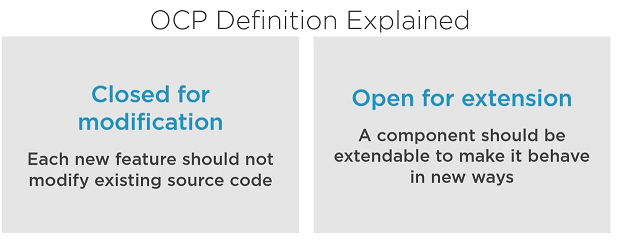
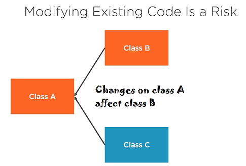
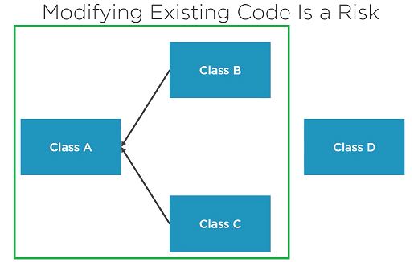

## Open Closed Principle
<pre style="color: aqua; font-size: x-large">
Classes, functions, and modules should be closed for
modification, but open for extension.
</pre>

 

### Why Should You Apply the OCP?
<pre>

1. New features can be added easily and with minimal cost

2. Minimizes the risk of regression bugs

3. Enforces decoupling by isolating changes in specific components,
   works along with the SRP

</pre>
***SOLID principles are most effective when applied together.***
##### OCP Implementation Strategies
***Inheritance***
<pre>
   class BankAccount {
       v transferMoney(double amount){
           // Business logic for local transfer
       }
   }
   class InternationalBankAccount extends BankAccount {
       @Override v transferMoney(double amount){
           // Business logic for international transfer
       }
   }

   Inheritance is good way to apply the ocp, it does however have a small drawback.
   Inheritance produces coupling between derived class and base class
</pre>
***Strategy Pattern***
<pre>

   Better approach is strategy pattern

   interface MoneyTransferProcessor {
      v transferMoney(double amount)();
   }

   class BankAccount implements MoneyTransferProcessor {
       @Override v transferMoney(double amount){
           // Business logic for local transfer
       }
   }
   class InternationalBankAccount implements MoneyTransferProcessor  {
       @Override v transferMoney(double amount){
           // Business logic for international transfer
       }
   }

   class MoneyTransferProcessorFactory {
      p v MoneyTransferProcessor build(TransferType type) {
         if(type == TransferType.Local ) {
             return new BankAccount();
         } else if(type == TransferType.Intl ) {
             return new InternationalBankAccount();
         }
      }
   }

   void processPayment(double amount, TransferType type) {
       MoneyTransferProcessor mtp = factory.build(type);
       mtp.transferMoney(amount);
   }
</pre>
#### Progressively Applying the OCP
* Start small - Make changes inline. Bug fixes can be implemented this way
* More changes - Consider inheritance
* Many changes / dynamic decision - Consider interfaces and design like strategy.
#### API
***A contract/agreement between different software components on how they should work together***
>><pre>A public framework or API is   under your control.  But clients might use it in ways that you aren't aware of.</pre>
<pre>

Exposed Framework/SDK

  class TaxCalculator{
     double calculate(Employee e){
        // business logic
     }
  }
Changes Can Break the Clients Implementation

  class TaxCalculator{
     double calculate(Employee e, String currency){
        // business logic
     }
  }

   Make framework/SDK Open for Modification

   interface AbstractTaxCalculator{
     double calculate(Employee e, String currency)();
   }

   class CustomerUSACalc extends AbstractTaxCalculator {
      double calculate(Employee e){
        // business logic
      }
   }

Best Practices for changing APIs

Do not change existing public contracts: data classes, signatures

Expose abstractions to your customers and let them add new feature on top of the framework.

If a breaking change is inevitable, give your clients time to adapt.
</pre>
<pre>
OCP is all about changes. Following this principle will lead
to elegant designs that are easy and painless to extend.
</pre>
